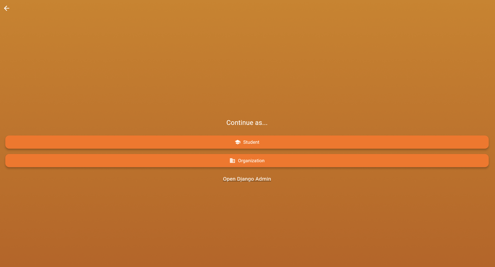
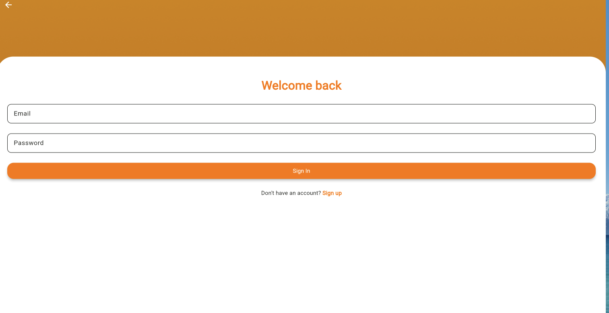
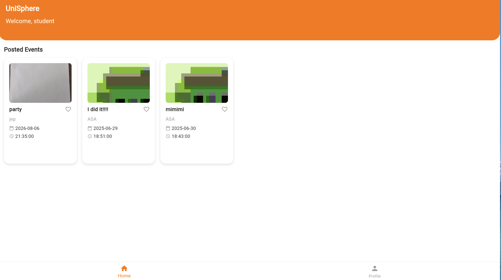
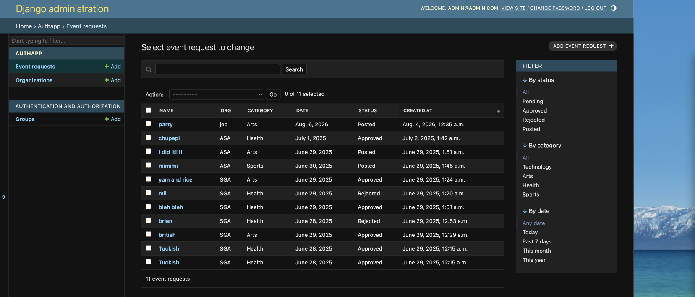
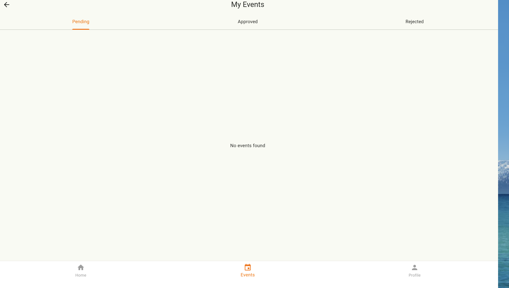

# UniSphere

A campus event management platform built with **Flutter** and **Django REST Framework**.

Students browse posted events. Organizations submit events for approval. Admins moderate events in Django Admin.

## What It Does

### Students
- Sign up and log in
- View all posted campus events on the home screen
- Profile with logout

### Screenshots

| Welcome | Choose a role |
|---|---|
|  |  |

| Student sign in | Student event feed |
|---|---|
|  |  |

| Django administration | Organization events |
|---|---|
|  |  |

### Organizations
- Register and log in
- Create event requests (pending admin approval)
- View events by status: pending, approved, rejected
- Publish approved events with a flyer upload
- Edit organization profile

### Admins
- Approve or reject events at `/admin/`
- Manage users and events through Django Admin

## Tech Stack

| Layer | Technology |
|-------|------------|
| Mobile | Flutter |
| Backend | Django 5, Django REST Framework|
| Database | SQLite (development) |
| Auth | JWT tokens with role-based permissions |

## Project Structure

```
UniSphere/
├── backend/
│   ├── requirements.txt
│   └── unisphere_backend/
│       ├── app/                 # Models, API views, routes, and tests
│       ├── unisphere_backend/   # Django settings and root routes
│       └── manage.py
├── flutter_projects/
│   ├── lib/
│   │   ├── core/                # API, configuration, models, and token storage
│   │   ├── screens/             # Student and organization flows
│   │   ├── theme/
│   │   └── widgets/             # Shared, actively used UI components
│   └── test/
└── docs/ARCHITECTURE.md
```

## Quick Start

### 1. Backend

```bash
cd backend/unisphere_backend
pip install -r ../requirements.txt
python manage.py migrate
python manage.py createsuperuser
python manage.py runserver 0.0.0.0:8000
```

### 2. Flutter App

```bash
cd flutter_projects
flutter pub get
flutter run
```

The app selects a development API URL by platform:

- Android emulator: `http://10.0.2.2:8000`
- iOS, macOS, Windows, and Linux: `http://127.0.0.1:8000`
- Web: `http://<browser-host>:8000`

For a physical device or custom backend, override it without editing source:

```bash
flutter run --dart-define=API_BASE_URL=http://YOUR_MACHINE_IP:8000
```

### 3. Test the Full Flow

1. Register an organization in the app
2. Log in as the org and create an event
3. Open `http://127.0.0.1:8000/admin/` and approve the event
4. In the app, go to Events → Approved → upload a flyer → Publish
5. Register a student account and view the event on the home screen

## API Endpoints

| Method | Endpoint | Description |
|--------|----------|-------------|
| POST | `/api/register/` | Student registration |
| POST | `/api/org/register/` | Organization registration |
| POST | `/api/token/` | Login (JWT) |
| GET | `/api/events/posted/` | Posted events (public) |
| POST | `/api/events/` | Create event (org only) |
| GET | `/api/events/mine/` | Org's events by status |
| POST | `/api/events/<id>/post/` | Publish approved event |
| GET/PUT | `/api/org/profile/` | Org profile |

## Running Tests

```bash
# Backend
cd backend/unisphere_backend
python manage.py test app

# Flutter static analysis
cd flutter_projects
flutter analyze

# Flutter tests
flutter test
```

The current Flutter test reaches the welcome screen, but its `UNISPHERE` assertion needs a RichText-aware finder before the suite will pass.

## Future Improvements

See [docs/ARCHITECTURE.md](docs/ARCHITECTURE.md) for the full architecture and planned production upgrades (PostgreSQL, env config, CI, deployment).

## License

Educational / portfolio project.
