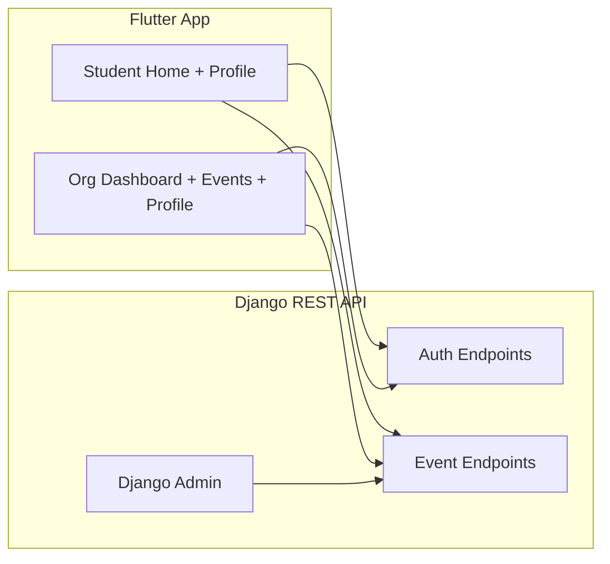
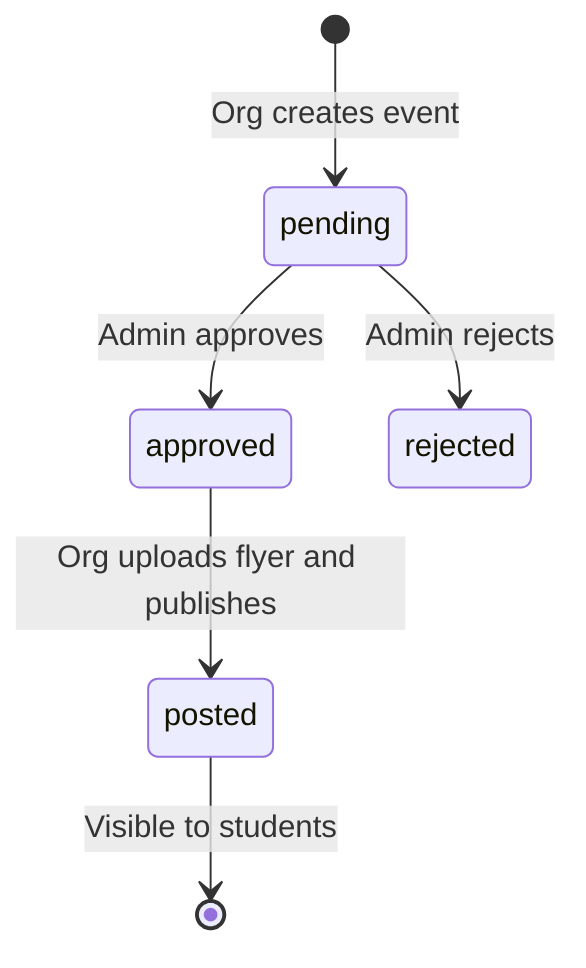

# UniSphere Architecture

UniSphere is a campus event platform with three roles:

- **Students** browse posted events
- **Organizations** submit events and publish approved ones
- **Admins** approve or reject events in Django Admin

## System Overview



## Event Lifecycle



## Backend Structure

```
backend/unisphere_backend/
├── authapp/
│   ├── models.py          # Organization (custom user), EventRequest
│   ├── serializers.py     # Request/response validation
│   ├── views.py           # REST API endpoints
│   ├── urls.py            # API routes
│   ├── admin.py           # Event moderation
│   ├── permissions.py     # Role-based access
│   └── tests.py           # API tests
└── unisphere_backend/
    └── settings.py
```

### API Endpoints

| Method | Endpoint | Auth | Description |
|--------|----------|------|-------------|
| POST | `/api/register/` | No | Student registration |
| POST | `/api/org/register/` | No | Organization registration |
| POST | `/api/token/` | No | Login (returns JWT + role) |
| POST | `/api/token/refresh/` | No | Refresh JWT |
| GET | `/api/events/posted/` | No | List posted events |
| POST | `/api/events/` | Org | Create event request |
| GET | `/api/events/mine/` | Org | Org events grouped by status |
| POST | `/api/events/<id>/post/` | Org | Publish approved event |
| GET/PUT | `/api/org/profile/` | Org | View/update org profile |

Admin moderation happens at `/admin/` — not through the mobile app.

## Flutter Structure

```
flutter_projects/lib/
├── core/
│   ├── config/env.dart           # API base URL
│   ├── storage/token_storage.dart
│   └── api/
│       ├── api_client.dart       # Shared HTTP client
│       ├── auth_service.dart
│       └── event_service.dart
├── screens/
│   ├── auth flow: welcome → entry → sign in/up
│   ├── student/: main_page, dashboard, profile
│   └── org/: org_main_page, dash, events, profile
└── widgets/
```

All network calls go through `core/api/`. Screens should not hardcode URLs.

## Data Model

**Organization** (custom user model)
- `email`, `name`, `password`, `user_type` (`student` | `organization`)
- Org-only fields: `category`, `description`, `logo`

**EventRequest**
- `name`, `category`, `description`, `date`, `time`, `contact`
- `org` (FK to Organization)
- `status`: `pending` | `approved` | `rejected` | `posted`
- `flyer` (optional image)

## Local Development

### Backend
```bash
cd backend/unisphere_backend
pip install -r ../requirements.txt
python manage.py migrate
python manage.py createsuperuser
python manage.py runserver 0.0.0.0:8000
```

### Flutter
```bash
cd flutter_projects
flutter pub get
flutter run
```

Use `http://10.0.2.2:8000` for Android emulator (configured in `lib/core/config/env.dart`).

## Future Improvements

- PostgreSQL instead of SQLite
- Environment variables for secrets and API URL
- Token refresh interceptor in `ApiClient`
- Push notifications for new events
- Search and category filters on student home
- CI with GitHub Actions running backend + Flutter tests
- Deploy backend (Railway/Render) and document production API URL
